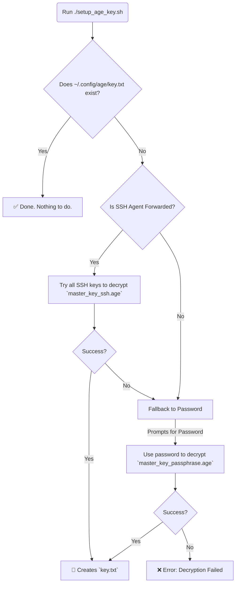

# 🔐 My Dotfiles 🚀

This repository contains [my](#my) personal dotfiles, managed securely across multiple machines using [chezmoi](https://www.chezmoi.io/).

This setup is designed around a flexible and secure bootstrap process. It uses a primary `age` private key to decrypt secrets, but this primary key itself is never stored in plain text. Instead, it is created on-demand using either a forwarded SSH key for convenience or a master password as a fallback.

If the private key material isn't available (at `~/.config/age/key.txt`) chezmoi apply will only place the config files that don't require decryption.

-----

## 🚀 Quick Start & Daily Usage

### Bootstrapping a New System

#### macOS Prerequisites

1. **Install Homebrew** (if not already installed):
```sh
/bin/bash -c "$(curl -fsSL https://raw.githubusercontent.com/Homebrew/install/HEAD/install.sh)"
```

2. **Install required tools**:
```sh
brew install chezmoi age
```

#### Linux Prerequisites

```sh
# Install age (example for Ubuntu/Debian)
sudo apt install age

# Install chezmoi
sh -c "$(curl -fsLS get.chezmoi.io)"
```

### Installation on a New Machine

Run this command to install `chezmoi` and apply the dotfiles from this repository.

```sh
sh -c "$(curl -fsLS get.chezmoi.io)" -- init --apply andreweick
```

### Initializing on a Machine with `chezmoi` already installed

If `chezmoi` is already installed, use this command to pull down the dotfiles:

```sh
chezmoi init [github.com/andreweick/dotfiles](https://github.com/andreweick/dotfiles) --apply
```

### Decrypting Secrets for the First Time

After installing, your secrets will still be encrypted. Run this script to decrypt them. It will try to use your SSH key first, then fall back to prompting for your master password.

```sh
"$(chezmoi source-path)/setup-age-key.sh"
```

> **Note:** The master password for fallback decryption is stored in 1Password at:
> `op://Private/xcjfxrcih4tzajtsocvlkpjgm4/password`

### Pulling Updates from Git

To pull the latest changes from your repository and apply them:

```sh
chezmoi update
```

-----

## 🤔 How It Works: The Bootstrap Strategy

The entire security model hinges on a single script, `setup_age_key.sh`, which creates the master decryption key (`~/.config/age/key.txt`). This key is required by `chezmoi` (as configured in `chezmoi.toml`) to decrypt all other secret files.

The setup script intelligently chooses one of two methods to create this key:

1.  **SSH Agent (Primary Method):** If you are connected to a machine with a forwarded SSH agent (`ssh -A`), the script will automatically try to use any of your available SSH keys to decrypt a special file (`master_key_ssh.age`) in this repository. This provides a convenient, passwordless setup experience.

2.  **Master Password (Fallback Method):** If the SSH agent is not available or fails, the script will fall back to prompting you for a master password. It uses this password to decrypt a different file (`master_key_passphrase.age`).

This hybrid approach provides the best of both worlds: passwordless convenience on remote systems and a reliable password fallback for your local machines.



-----

## 📜 Managing Secrets

### How to Edit Secret Files

You cannot edit encrypted source files directly. Instead, use the `chezmoi edit` command, which handles the decryption and re-encryption for you automatically.

**Example: Editing the RClone secrets**

```sh
chezmoi edit ~/.config/rclone/secrets.conf
```

`chezmoi` will find the corresponding source file (`.../encrypted_private_secrets.conf.age`), decrypt it into a temporary file, open your editor, and then re-encrypt it when you save and close.

### Partitioning Files with Secrets (e.g., `rclone.conf`)

Files that contain a mix of public and private data are split into two parts:

1.  **A Base Template (`.../rclone.conf.tmpl`):** A template file containing all the non-sensitive configuration. This file contains logic to conditionally include the secrets.
2.  **An Encrypted Secrets File (`.../encrypted_private_secrets.conf.age`):** A small, fully encrypted file containing *only* the sensitive parts.

The base template uses `chezmoi`'s template functions to check if the `key.txt` exists. If it does, it decrypts the secrets file in memory and appends its contents to the final generated file.

-----

## 🕰️ Using Atuin for Shell History

[Atuin](https://atuin.sh/) provides encrypted, searchable, and synced shell history across all your machines.

### Initial Setup

**Note:** On first run after bootstrapping a new system, you'll need to log in to Atuin and sync your history:

```sh
# Log in to Atuin (you'll need your username and password/key)
atuin login

# Force an initial sync to download your history from other machines
atuin sync --force
```

### Daily Usage

Atuin automatically syncs your history in the background. You can search your history by pressing `Ctrl+R` in your shell.

To manually sync at any time:

```sh
atuin sync
```

-----

## 🔄 Maintenance: Updating Your Keys

This system uses two helper scripts: `setup_age_key.sh` for bootstrapping and `generate_encrypted_keys.sh` for maintenance.

### How to Add a New SSH Key (e.g., for a new laptop)

When you get a new computer or generate a new SSH key, you need to grant it permission to decrypt your master `age` key.

1.  **Ensure the new public key is in `~/.ssh`** on the machine where you are running the generation script.
2.  **Run the generation script:**
    ```sh
    ./generate_encrypted_keys.sh
    ```
3.  The script will detect `master_key_ssh.age` already exists and ask `Overwrite? (y/N)`. **Type `y` and press Enter.**
4.  The script will then ask to overwrite the passphrase file. You can safely type `n` unless you also want to change your master password.
5.  A new `master_key_ssh.age` file will be created. This new file is now encrypted to **all** your SSH keys, both old and new.
6.  **Copy this new `master_key_ssh.age`** into your `chezmoi` source directory, overwriting the old one (e.g., at `private_dot_config/age/`).
7.  Commit the change to your Git repository.

### How to Change Your Master Password

1.  **Run the generation script:**
    ```sh
    ./generate_encrypted_keys.sh
    ```
2.  When it asks to overwrite the SSH key file, you can safely type `n`.
3.  When it asks to overwrite `master_key_passphrase.age`, **type `y` and press Enter.**
4.  Enter and confirm your new master password when prompted.
5.  A new `master_key_passphrase.age` file will be created.
6.  **Copy this new `master_key_passphrase.age`** into your `chezmoi` source directory, overwriting the old one.
7.  Commit the change to your Git repository.

<!-- end list -->
<a id="my"></a>
```ascii

                   .oooooooooo.
                 .:%%%%((<<<<<<<%:.
              .:%%%%(((=(((((<<<%%%%:.
            /%%l/~ `-.=(((((((<<'~\l%%\
         l/:%%:          ~~~~       :%%:\l
        /l:%::                       ::==l\
       l/ =::                         ::= \l
      /l =::  ·                     ·  ::= l\
     l| =::::   ·                 ·   ::::= |l
     // /i:::: ·   ·          ·    · ::::i\ \\
     /l//!:·::                       ::·:!\\l\
     /l///:  _     ...      ...      _  :\\l\\
     ll/:  oOOOOoo.._ ::::::  _..ooOOOOo  :\ll
      //oohHHHHHHHHhOo_.) (._oOhHHHHHHHHhoo\\
     _J##7°~:¯¯¯=:887###OOO###788:=¯¯¯:~°7##L_
    i `%#:L:.o<#▓)>%8%%#7¯7##%8%<#▓)>o..J:#i' i
    |/)!#:::¯¯=-~~=::%H/   \H%::=~~-=¯¯: :#!(\|
    :))%°L. ¨    .:::H/)   (\H::         J°%((:
     i!%:°Lo._____.o#°:.   .:°#o._____.oJ°:%!i
     |(|:::¯°°°°°°°¯ ::l   l:: ¯°°°°°°°¯:::|)|
     !_l::::       :( :     : ):       ::::l_!
       l:::::.   .:/:`°7/%/7°':\:.   .:::::l
        :::::::::::     ¯=¯     :::::::::::
        l:::::: (::..__ !=! __..::) ::::::l
        :i::::   JLoJOOOL6JOOOLoJL   ::::i:
         !::::: :  `·o_¯¯¯¯¯_o·'  : :::::!
          o:::::::. :::!888!::: .:::::::o
          l8::::(  ·.::°°~°°::.·  )::::8l
         J:O°oo:l:               :l:oo°O:L
      o8##:::°8%%Oo...·::::·....oO%%8°:::##8o
   o8#####i:::°%%°87oooOOOOOooo78°%%°:::i#####8o
o8########|. ::::°°%%°°88888°°%%°°:::: .|########8o
##########!\:   :::::°%%%%%%%°:::::   :/!##########
##########i!\:.     :::::::::::     .:/!i##########
Andy######|:i\::.                 .::/i:|#######adl
```
