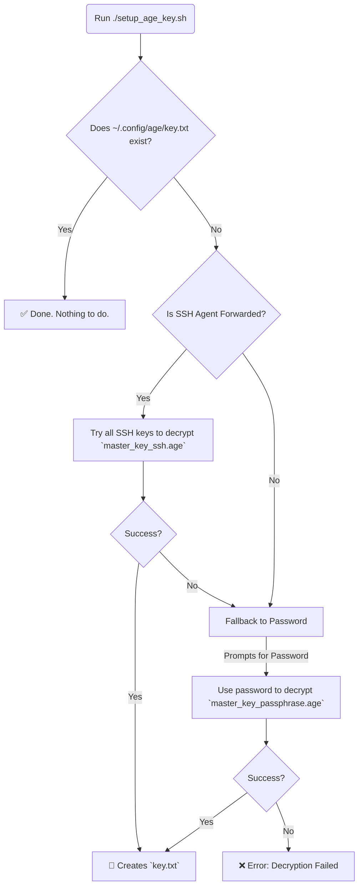

# 🔐 My Dotfiles 🚀

This repository contains [my](#my) personal dotfiles, managed securely across multiple machines using [chezmoi](https://www.chezmoi.io/).

This setup is designed around a flexible and secure bootstrap process. It uses a primary `age` private key to decrypt secrets, but this primary key itself is never stored in plain text. Instead, it is created on-demand using either a forwarded SSH key for convenience or a master password as a fallback.

If the private key material isn't available (at `~/.config/age/key.txt`) chezmoi apply will only place the config files that don't require decryption.

-----

## 🚀 Quick Start & Daily Usage

### Forcing Homebrew Updates

By default, Homebrew packages are synced weekly. To force an immediate update:

```sh
BREW_FORCE_UPDATE=1 chezmoi apply
```

This will bypass the weekly timer and immediately sync your Homebrew packages with your brewfile.

-----

### Adding an encrypted rclone config

**Example: Editing the RClone secrets**

```sh
chezmoi edit ~/.config/rclone/secrets.conf
chezmoi apply
```


### Bootstrapping a New System

#### macOS Prerequisites

1. **Install Homebrew** (if not already installed):
```sh
/bin/bash -c "$(curl -fsSL https://raw.githubusercontent.com/Homebrew/install/HEAD/install.sh)"
```

2. **Install required tools**:
```sh
brew install chezmoi age
```

#### Linux Prerequisites

```sh
# Install age (example for Ubuntu/Debian)
sudo apt install age

# Install chezmoi
sh -c "$(curl -fsLS get.chezmoi.io)"
```

### Installation on a New Machine

**Two-Phase Bootstrap Process:**

1. **Phase 1 - Apply Non-Encrypted Files:**
   ```sh
   sh -c "$(curl -fsLS get.chezmoi.io)" -- init --apply andreweick
   ```
   This installs chezmoi and applies all non-encrypted dotfiles. Encrypted files are automatically skipped when the age key is missing.

2. **Phase 2 - Decrypt and Apply Secrets:**
   ```sh
   "$(chezmoi source-path)/setup-age-key.sh"
   chezmoi apply
   ```
   The setup script creates your age decryption key, then the second `chezmoi apply` processes all the encrypted files.

### Initializing on a Machine with `chezmoi` already installed

If `chezmoi` is already installed, use the same two-phase process:

1. **Phase 1 - Apply Non-Encrypted Files:**
   ```sh
   chezmoi init github.com/andreweick/dotfiles --apply
   ```

2. **Phase 2 - Decrypt and Apply Secrets:**
   ```sh
   "$(chezmoi source-path)/setup-age-key.sh"
   chezmoi apply
   ```

> **Note:** The master password for fallback decryption is stored in 1Password at:
> `op://Private/xcjfxrcih4tzajtsocvlkpjgm4/password`

### Pulling Updates from Git

To pull the latest changes from your repository and apply them:

```sh
chezmoi update
```

-----

## 🤔 How It Works: The Bootstrap Strategy

The entire security model hinges on a single script, `setup_age_key.sh`, which creates the master decryption key (`~/.config/age/key.txt`). This key is required by `chezmoi` (as configured in `chezmoi.toml`) to decrypt all other secret files.

The setup script intelligently chooses one of two methods to create this key:

1.  **SSH Agent (Primary Method):** If you are connected to a machine with a forwarded SSH agent (`ssh -A`), the script will automatically try to use any of your available SSH keys to decrypt a special file (`master_key_ssh.age`) in this repository. This provides a convenient, passwordless setup experience.

2.  **Master Password (Fallback Method):** If the SSH agent is not available or fails, the script will fall back to prompting you for a master password. It uses this password to decrypt a different file (`master_key_passphrase.age`).

This hybrid approach provides the best of both worlds: passwordless convenience on remote systems and a reliable password fallback for your local machines.



-----

## 📜 Managing Secrets

### Adding New Encrypted Files

To add a new file with secrets to your dotfiles:

1. **Create the file in your home directory first:**
   ```sh
   # Create and edit the file where it will live
   touch ~/.config/myapp/secrets.conf
   nvim ~/.config/myapp/secrets.conf
   ```

2. **Add it to chezmoi with encryption:**
   ```sh
   chezmoi add ~/.config/myapp/secrets.conf --encrypted
   ```

   This will copy the file to your chezmoi source directory and encrypt it using your `~/.config/age/key.txt`.

3. **For future edits, always use `chezmoi edit`:**
   ```sh
   chezmoi edit ~/.config/myapp/secrets.conf
   ```

### How Encrypted Files Work with Missing Keys

Chezmoi intelligently handles missing decryption keys:

- **When `~/.config/age/key.txt` is missing**: `chezmoi apply` will automatically skip all encrypted `.age` files without errors
- **When the key is present**: `chezmoi apply` will decrypt and apply all encrypted files normally

This enables the elegant bootstrap workflow:
1. Fresh machine → `chezmoi apply` → only non-encrypted configs are applied
2. Run `./setup-age-key.sh` → creates your decryption key
3. Run `chezmoi apply` again → now encrypted files are also applied

No manual configuration needed - chezmoi automatically detects key availability.

### How to Edit Secret Files

You cannot edit encrypted source files directly. Instead, use the `chezmoi edit` command, which handles the decryption and re-encryption for you automatically.

**Example: Editing the RClone secrets**

```sh
chezmoi edit ~/.config/rclone/secrets.conf
```

`chezmoi` will find the corresponding source file (`.../encrypted_private_secrets.conf.age`), decrypt it into a temporary file, open your editor, and then re-encrypt it when you save and close.

### Partitioning Files with Secrets (e.g., `rclone.conf`)

Files that contain a mix of public and private data are split into two parts:

1.  **A Base Template (`.../rclone.conf.tmpl`):** A template file containing all the non-sensitive configuration. This file contains logic to conditionally include the secrets.
2.  **An Encrypted Secrets File (`.../encrypted_private_secrets.conf.age`):** A small, fully encrypted file containing *only* the sensitive parts.

The base template uses `chezmoi`'s template functions to check if the `key.txt` exists. If it does, it decrypts the secrets file in memory and appends its contents to the final generated file.

-----

## 🕰️ Using Atuin for Shell History

[Atuin](https://atuin.sh/) provides encrypted, searchable, and synced shell history across all your machines.

### Initial Setup

**Note:** On first run after bootstrapping a new system, you'll need to log in to Atuin and sync your history:

```sh
# Log in to Atuin (you'll need your username and password/key)
atuin login

# Force an initial sync to download your history from other machines
atuin sync --force
```

### Daily Usage

Atuin automatically syncs your history in the background. You can search your history by pressing `Ctrl+R` in your shell.

To manually sync at any time:

```sh
atuin sync
```

-----

## 🔄 Maintenance: Updating Your Keys

This system uses two helper scripts: `setup_age_key.sh` for bootstrapping and `generate_encrypted_keys.sh` for maintenance.

### How to Add a New SSH Key (e.g., for a new laptop)

When you get a new computer or generate a new SSH key, you need to grant it permission to decrypt your master `age` key.

1.  **Ensure the new public key is in `~/.ssh`** on the machine where you are running the generation script.
2.  **Run the generation script:**
    ```sh
    ./generate_encrypted_keys.sh
    ```
3.  The script will detect `master_key_ssh.age` already exists and ask `Overwrite? (y/N)`. **Type `y` and press Enter.**
4.  The script will then ask to overwrite the passphrase file. You can safely type `n` unless you also want to change your master password.
5.  A new `master_key_ssh.age` file will be created. This new file is now encrypted to **all** your SSH keys, both old and new.
6.  **Copy this new `master_key_ssh.age`** into your `chezmoi` source directory, overwriting the old one (e.g., at `private_dot_config/age/`).
7.  Commit the change to your Git repository.

### How to Change Your Master Password

1.  **Run the generation script:**
    ```sh
    ./generate_encrypted_keys.sh
    ```
2.  When it asks to overwrite the SSH key file, you can safely type `n`.
3.  When it asks to overwrite `master_key_passphrase.age`, **type `y` and press Enter.**
4.  Enter and confirm your new master password when prompted.
5.  A new `master_key_passphrase.age` file will be created.
6.  **Copy this new `master_key_passphrase.age`** into your `chezmoi` source directory, overwriting the old one.
7.  Commit the change to your Git repository.

-----

## 📁 Private Files (Encrypted Fonts, Licenses, Scripts)

The `~/.config/private-files/` directory contains decrypted sensitive files like licensed fonts, software licenses, and installation scripts. These files are automatically decrypted during `chezmoi apply` when your age key is available.

### Directory Structure

```
~/.config/private-files/
├── fonts/        # Licensed font files (.otf, .ttf)
├── licenses/     # License files and installation scripts
└── README        # Explains the directory purpose
```

### Adding New Encrypted Files

To add a new licensed font or sensitive file:

1. **Create the final directory structure:**
   ```sh
   mkdir -p ~/.config/private-files/fonts
   ```

2. **Place your file in the final location:**
   ```sh
   cp your-licensed-font.otf ~/.config/private-files/fonts/
   ```

3. **Add it to chezmoi with encryption:**
   ```sh
   chezmoi add --encrypt ~/.config/private-files/fonts/your-licensed-font.otf
   ```

4. **Verify the encrypted file was created:**
   ```sh
   ls "$(chezmoi source-path)/private_dot_config/private-files/fonts/"
   # You should see: encrypted_your-licensed-font.otf.age
   ```

### How It Works

- **Encrypted Storage**: Files are stored as `encrypted_*.age` in the chezmoi source directory
- **Automatic Decryption**: During `chezmoi apply`, files automatically decrypt to `~/.config/private-files/` if your age key (`~/.config/age/key.txt`) exists
- **Graceful Skipping**: If no age key is available, encrypted files are silently skipped without errors
- **Manual Usage**: Files are decrypted for you to manually install/use as needed (no automatic installation)

### Security Notes

- The `~/.config/private-files/` directory is created with `0700` permissions (owner-only access)
- This directory should **never** be added to git
- Only the encrypted `.age` versions are stored in your repository
- Original files are safely encrypted using your age recipient key

### Examples

**Adding a licensed font:**
```sh
cp OperatorMono-Bold.otf ~/.config/private-files/fonts/
chezmoi add --encrypt ~/.config/private-files/fonts/OperatorMono-Bold.otf
```

**Adding a license file:**
```sh
cp software-license.txt ~/.config/private-files/licenses/
chezmoi add --encrypt ~/.config/private-files/licenses/software-license.txt
```

**Adding an installation script:**
```sh
cp install-licensed-software.sh ~/.config/private-files/licenses/
chezmoi add --encrypt ~/.config/private-files/licenses/install-licensed-software.sh
```

### For AI Assistants

This system uses chezmoi's built-in age encryption. When the age identity file exists at `~/.config/age/key.txt`, chezmoi automatically decrypts all `.age` files during apply operations. Files are stored in the chezmoi source directory with the `encrypted_` prefix and `.age` suffix. The decryption process is completely handled by chezmoi's templating system - no custom scripts needed.

<!-- end list -->
<a id="my"></a>
```ascii

                   .oooooooooo.
                 .:%%%%((<<<<<<<%:.
              .:%%%%(((=(((((<<<%%%%:.
            /%%l/~ `-.=(((((((<<'~\l%%\
         l/:%%:          ~~~~       :%%:\l
        /l:%::                       ::==l\
       l/ =::                         ::= \l
      /l =::  ·                     ·  ::= l\
     l| =::::   ·                 ·   ::::= |l
     // /i:::: ·   ·          ·    · ::::i\ \\
     /l//!:·::                       ::·:!\\l\
     /l///:  _     ...      ...      _  :\\l\\
     ll/:  oOOOOoo.._ ::::::  _..ooOOOOo  :\ll
      //oohHHHHHHHHhOo_.) (._oOhHHHHHHHHhoo\\
     _J##7°~:¯¯¯=:887###OOO###788:=¯¯¯:~°7##L_
    i `%#:L:.o<#▓)>%8%%#7¯7##%8%<#▓)>o..J:#i' i
    |/)!#:::¯¯=-~~=::%H/   \H%::=~~-=¯¯: :#!(\|
    :))%°L. ¨    .:::H/)   (\H::         J°%((:
     i!%:°Lo._____.o#°:.   .:°#o._____.oJ°:%!i
     |(|:::¯°°°°°°°¯ ::l   l:: ¯°°°°°°°¯:::|)|
     !_l::::       :( :     : ):       ::::l_!
       l:::::.   .:/:`°7/%/7°':\:.   .:::::l
        :::::::::::     ¯=¯     :::::::::::
        l:::::: (::..__ !=! __..::) ::::::l
        :i::::   JLoJOOOL6JOOOLoJL   ::::i:
         !::::: :  `·o_¯¯¯¯¯_o·'  : :::::!
          o:::::::. :::!888!::: .:::::::o
          l8::::(  ·.::°°~°°::.·  )::::8l
         J:O°oo:l:               :l:oo°O:L
      o8##:::°8%%Oo...·::::·....oO%%8°:::##8o
   o8#####i:::°%%°87oooOOOOOooo78°%%°:::i#####8o
o8########|. ::::°°%%°°88888°°%%°°:::: .|########8o
##########!\:   :::::°%%%%%%%°:::::   :/!##########
##########i!\:.     :::::::::::     .:/!i##########
Andy######|:i\::.                 .::/i:|#######adl
```
